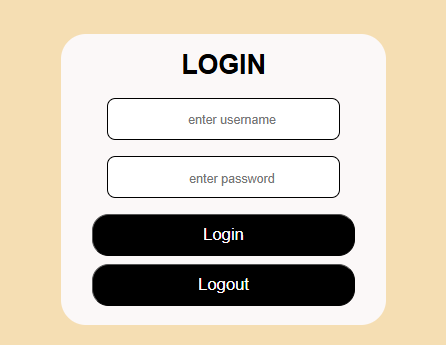
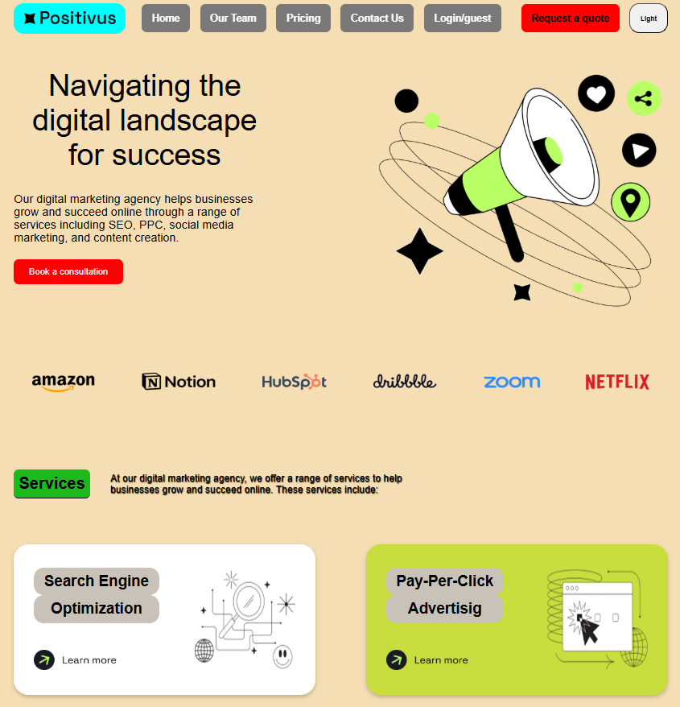
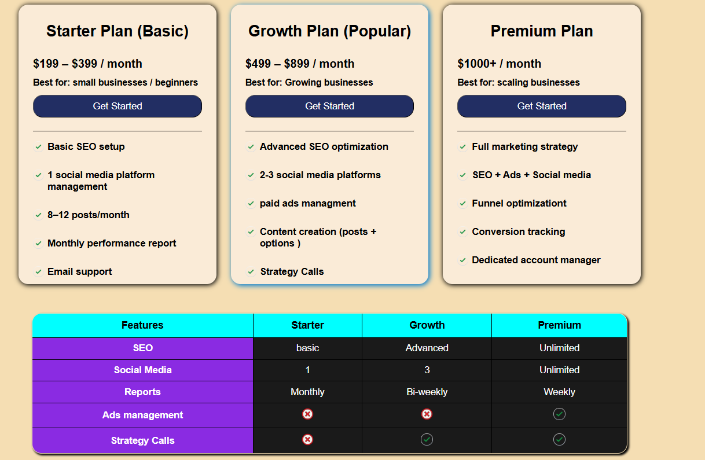
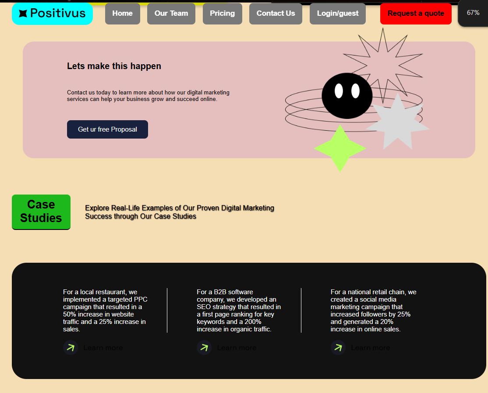
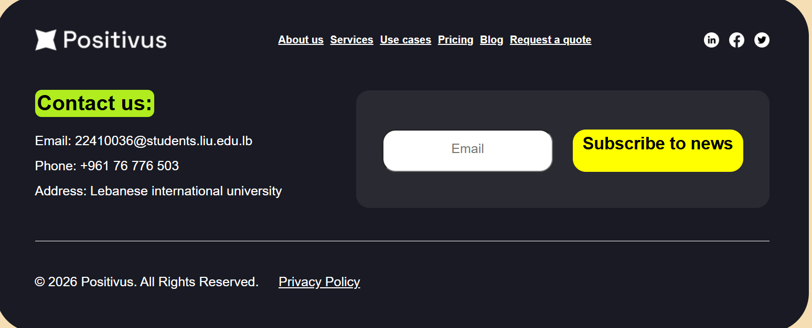

This is a web application that I originally built using plain HTML and CSS, but I completely rebuilt it using React to make it dynamic.

I used React Router so you can click around and switch pages instantly without the website having to reload every time.

What it does:
Dynamic Login System: I used useState to build a login page. When you type your name and log in, the navigation bar at the top updates automatically.

Navbar Changes: The navbar normally says Login / User. Once you log in, it uses props to pass your name to the navbar, changing it to Login / [Your Name].

Logout Feature: If you click logout, it clears the state, removes your name, and resets the navbar back to the default Login / User

